# This project is a way to create shorthand es for Docker in Windows or Linux

## Setup

# Setup for Windows

1. Run the following command `notepad.exe $PROFILE`
2. Paste the content from profile-scripts.ps1 in the $PROFILE file
3. Run `. $PROFILE` to reload the terminal session

# Setup for Linux

1. Run the following command `cat ~/.bashrc | grep .bash_es`
2. Observe the results, if the file exists copy the file into the path the is defined in
3. If the file doesn't exist copy the .bash_es file into the ~ directory
4. If it doesn't exist, add the following command to the end your ~/.bashrc file `. ~/.bashrc`
5. Run `~/.bashrc` to reload the terminal session

# Command breakdown

| _Command_ |           _Example Usage_           |         _Sample output_          |
| :-------: | :---------------------------------: | :------------------------------: |
|   cwd\*   |               $(cwd)                |  /opt/test/folder\ with\ space   |
|    dcp    |                 dcp                 |  |
|   ddown   |       ddown compose-file.yml        | 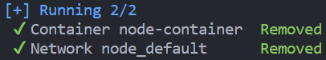 |
|    dex    |         dex container-name          | 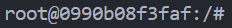  |
|   dexs    |         dexs container-name         |  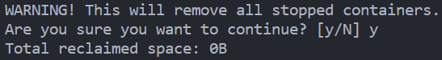   |
|    dgo    | dgo compose-file.yml container-name | 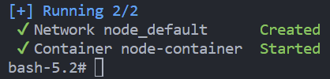 |
|    di     |                 di                  |   |
|    dip    |                 dip                 | 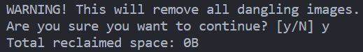  |
|    dk     |            dk image-name            |   |
|    ds     |                 ds                  | 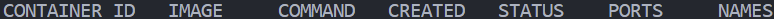  |
|   drun    |           drun image-name           |   |
|   druns   |          druns image-name           |   |
|    dvp    |                 dvp                 | 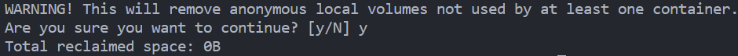 |
|  dprune   |               dprune                | 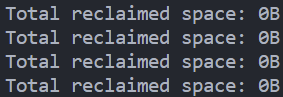 |
|    dup    |        dup compose-file.yml         | 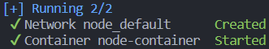 |
|   grab    |         grab container-name         | 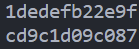 |
|   igrab   |          igrab image-name           |  |
|   logs    |         logs container-name         | 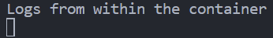 |
|    rmi    |           rmi image-name            |   |
|   up\*    |                 up                  | 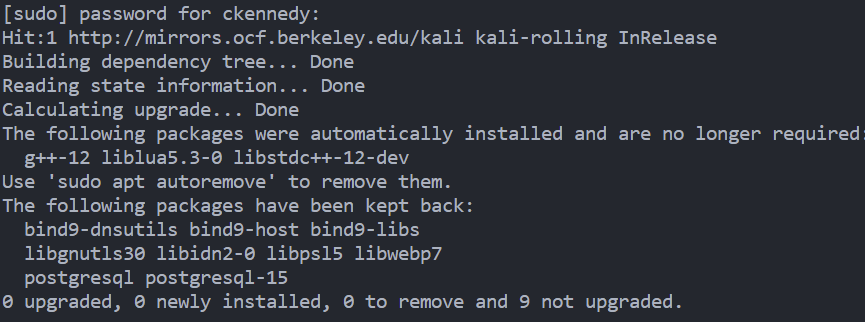  |

- Commands with a `*` are only available in Linux

# Command definitions

| _Command_ |                                                                                              _Definition_                                                                                              |
| :-------: | :----------------------------------------------------------------------------------------------------------------------------------------------------------------------------------------------------: |
|    cwd    |                                          run cwd to list the current working directory (similar to pwd) but it will escape all sensetive characeters in Linux                                          |
|    dcp    |                                                                                    docker container prune shorthand                                                                                    |
|   ddown   |                                                                            pass the docker compose file name and this will                                                                             |
|    dex    |                                                      pass any keyword from a container and this will execute a bash script inside of a container                                                       |
|   dexs    |                                                      pass any keyword from a container and this will execute a shell script inside of a container                                                      |
|    dgo    | pass two arguments, the first is the docker compose name and the second is any keyword for the desired container and this will deploy a compose file and execute a bash script inside of the container |
|    di     |                                                                         run di to list all images on the current docker daemon                                                                         |
|    dip    |                                                                                      docker image prune shorthand                                                                                      |
|    dk     |                                                               pass any keyword from a container and this will kill the running container                                                               |
|  dprune   |                                                                           shorthand to purge all hanging resources in docker                                                                           |
|   drun    |                                                  pass any keyword from an image and this will deploy an image with the entrypoint being a bash script                                                  |
|   druns   |                                                 pass any keyword from an image and this will deploy an image with the entrypoint being a shell script                                                  |
|    ds     |                                                                   run ds to list all running containers on the current docker daemon                                                                   |
|    dup    |                                      pass the docker compose file name and this will rebuild(if build is specified) and deploy all services in that compose file                                       |
|    dvp    |                                                                                      docker image prune shorthand                                                                                      |
|   grab    |                                                   pass any keyword from a container and this will return the container id based on the input string                                                    |
|   igrab   |                                                       pass any keyword from an image and this will return the image id based on the input string                                                       |
|   logs    |                                              pass any keyword from a container and this will tail the log stream from that container (CTRL + C to exits)                                               |
|    rmi    |                                                         pass any keyword for a container and this will remove all images which match the input                                                         |
|    up     |                                                                  run this to update and upgrade all packages on a debian based system                                                                  |
